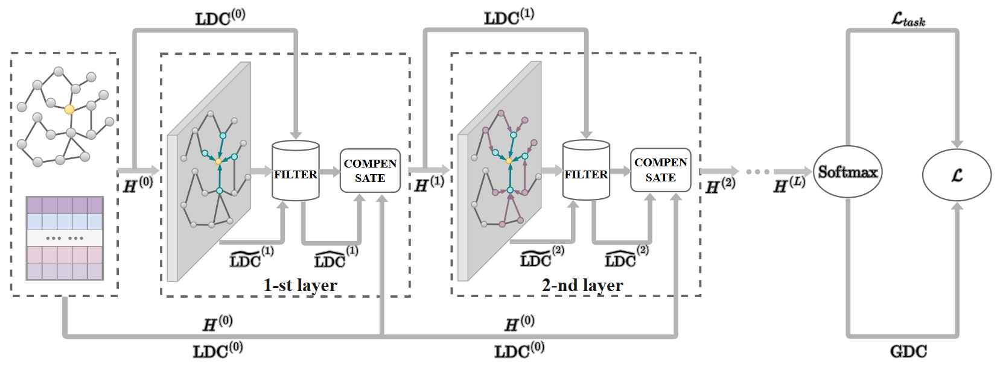

# 2024年4月16日

## Disc-GNN

> Improving Distinguishability of Class for Graph Neural Networks [AAAI 2024]

### Distinguishability of Class

Function: indirectly evaluate the learned node representations.

**Local Distinguishability of Class (LDC)**:

$$
z_i^{(l)}=\text{Softmax}(h_i^{(l)}\hat{W}^{(l)}),\\
\text{LDC}_i^{(l)}=\max(z_i^{(l)})-\min(z_i^{(l)})
$$

**Global Distinguishability of Class (GDC)**:

$$
\text{GDC}^{(l)}=\frac{1}{N}\sum_{v_i\in\mathcal{V}}\text{LDC}_i^{(l)}
$$

### Framework

